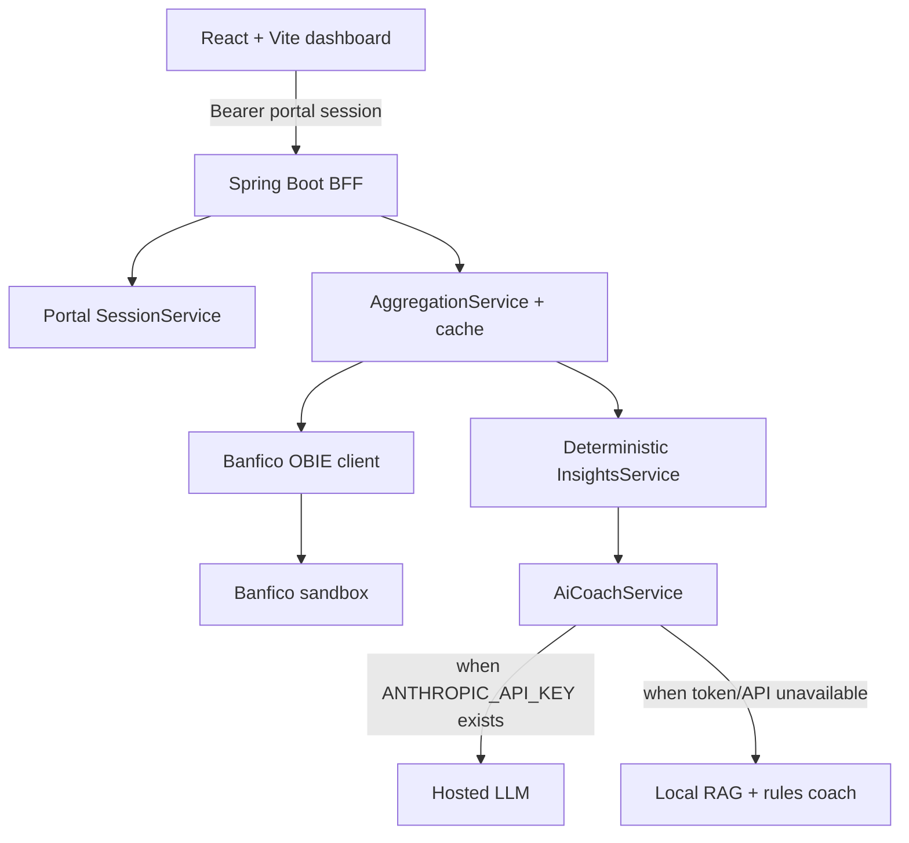

# Banfico MoneySense — resilient AI banking coach

MoneySense is a Spring Boot + React Open Banking dashboard built during the Banfico AI Hackathon. The original demo had the right idea but depended too much on live sandbox/API availability and did not make the product story obvious enough for judges. This version reframes it as a **resilient financial co-pilot**: deterministic banking analytics first, hosted AI when configured, and an offline retrieval/rules coach when tokens or third-party APIs are unavailable.

## What would have made this a prize-winning demo

1. **Show a real user problem, not just API calls** — “I got paid, bills are landing, can I afford this weekend?” is more compelling than listing accounts and balances.
2. **Never let AI invent money** — all totals, trends, anomalies, subscriptions and health scores are computed in Java; AI only explains and recommends.
3. **Survive dead APIs on stage** — the backend now keeps the coach useful without an LLM token via a local RAG-style knowledge base over computed insights.
4. **One dashboard endpoint** — judges see instant value from `/api/insights/overview` instead of waiting for multiple stitched calls.
5. **Actionable insights** — every answer should end with a next step: review a subscription, verify an anomaly, reduce a category, or build a cash buffer.

## Target real-time scenarios

| Scenario | User question | Product response |
|---|---|---|
| Payday safety check | “Can I spend £150 this weekend?” | Compares current balance, typical monthly expense, recurring commitments and recent anomalies; suggests a safe spend range or says what data is missing. |
| Subscription leakage | “What should I cancel?” | Detects recurring merchants, annualises the cost, ranks the highest-value review candidates. |
| Fraud/anomaly triage | “Anything suspicious?” | Uses explainable z-score/category-average detection and links the flagged transaction. |
| Spending drift | “Why am I saving less?” | Surfaces month-on-month category changes and top merchants driving the change. |
| Judge-safe AI fallback | “Give me advice” with no API key | Uses retrieved local snippets from health, category, subscription and anomaly facts instead of failing. |

## Architecture



### AI strategy

- **Current implementation:** `AiCoachService` sends pre-computed JSON to a hosted model only when `ANTHROPIC_API_KEY` is configured. Otherwise it builds a small in-memory knowledge base from overview facts and retrieves the most relevant snippets for a deterministic response.
- **Spring AI upgrade path:** replace the local retrieval code with `ChatClient` + `VectorStore` while keeping `InsightsService` as the source of truth. Store derived fact documents like `health`, `category`, `subscription`, `anomaly`, and `transaction`; never embed raw secrets or credentials.
- **RAG pipeline:** ingest normalized transactions → compute insight facts → chunk facts by business topic → retrieve by user query → generate grounded answer with citations/sources.

## Repository layout

| Path | Purpose |
|---|---|
| `backend/` | Spring Boot BFF, Banfico client, deterministic insights, AI/RAG coach. |
| `backend/ARCHITECTURE.md` | Backend flow, endpoint contract and operations notes. |
| `banfico-ai-hackathon/` | React/Vite frontend with dashboard, transactions and assistant UI. |

## Run locally

```bash
cd backend
mvn spring-boot:run

cd ../banfico-ai-hackathon
npm install
npm run dev
```

Optional hosted AI:

```bash
export ANTHROPIC_API_KEY=your_key_here
```

If no key is provided, `/api/chat` and `/api/insights/coach` still return useful local RAG answers with `mode=local-rag:no-api-key`.

## Next improvements

- Add Spring AI `ChatClient` profiles for OpenAI/Anthropic/Ollama and keep the current local coach as the `offline-demo` profile.
- Add H2/Postgres persistence for sessions, consent grants and cached OBIE snapshots.
- Add a synthetic data seeding script with named personas: student, family, freelancer, high-income-low-savings.
- Add event streaming for “new transaction arrived” scenarios and push anomaly alerts over SSE/WebSocket.
- Add evaluation tests for prompt grounding: answer must mention only figures present in `Insights.Overview`.
