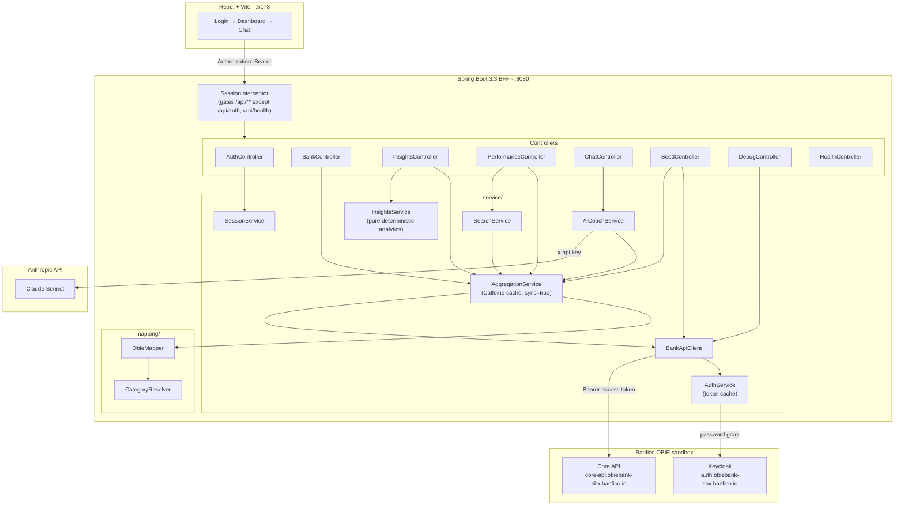
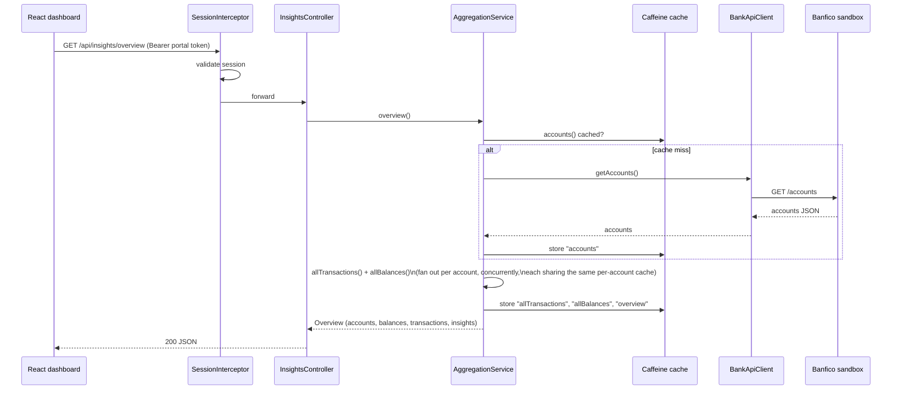
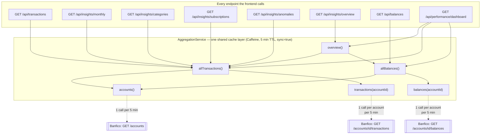

# Banfico AIS Backend

A Spring Boot **BFF (Backend-for-Frontend)** that sits between a React dashboard
and the Banfico OBIE AISP v4.0 sandbox. It aggregates accounts, balances and
transactions into one coherent view, runs a deterministic financial-insights
engine over that data, and layers an AI coach on top to narrate it — hosted Claude when a token exists, or a local retrieval/rules coach when it does not — without ever letting the model touch the arithmetic.

```
React (Vite) ──► Spring Boot BFF ──► Banfico OBIE sandbox (accounts/balances/transactions)
                        │
                        └──► AI coach — Anthropic when configured, local RAG fallback otherwise
```

---

## Table of contents

1. [Core requirements coverage](#core-requirements-coverage)
2. [Architecture diagram](#architecture-diagram)
3. [Two identities — the key design decision](#two-identities--the-key-design-decision)
4. [Layer-by-layer responsibilities](#layer-by-layer-responsibilities)
5. [Caching architecture](#caching-architecture)
6. [Project structure](#project-structure)
7. [Getting started](#getting-started)
8. [Configuration reference](#configuration-reference)
9. [API reference](#api-reference)
10. [Insights engine — how each number is computed](#insights-engine--how-each-number-is-computed)
11. [AI coaching layer](#ai-coaching-layer)
12. [Data model](#data-model)
13. [Error handling](#error-handling)
14. [Known limitations](#known-limitations)
15. [Troubleshooting — first five minutes](#troubleshooting--first-five-minutes)
16. [Roadmap](#roadmap)

---

## Core requirements coverage

| Requirement | Where it lives |
|---|---|
| Portal home page + login page | `AuthController`, `SessionService` (frontend consumes this) |
| Fetch & display account information | `GET /api/accounts`, `GET /api/accounts/{id}` |
| Retrieve balances | `GET /api/accounts/{id}/balances`, `GET /api/balances` |
| Retrieve transaction history | `GET /api/accounts/{id}/transactions`, `GET /api/transactions` |
| Unified dashboard view | `GET /api/insights/overview` — one call, everything the dashboard needs |
| Spending summaries / monthly analysis | `InsightsService.monthlySummaries()` → `GET /api/insights/monthly` |
| Category-wise expenditure insights | `InsightsService.categoryBreakdown()` → `GET /api/insights/categories` |
| Income vs expense trends | Part of `MonthlySummary` (income, expense, net, savings rate) |
| Unusual spending detection | `InsightsService.detectAnomalies()` → `GET /api/insights/anomalies` |
| Financial health observations | `InsightsService.health()` → embedded in `Overview.health` |
| AI-powered development | `AiCoachService` — Claude narrates pre-computed figures |

---

## Architecture diagram



### Request lifecycle (a typical dashboard load)



---

## Two identities — the key design decision

| | Who | Where | Purpose |
|---|---|---|---|
| **Portal login** | your demo users | `SessionService` + `app.portal-*` | gates the dashboard UI |
| **Bank service account** | the app itself | `AuthService` + `bank.username/password` | calls the Banfico sandbox |

The sandbox issues **one** credential per team, so a per-user Keycloak
password grant is impossible without handing every user the team's bank
password. Treating the bank credential as a service account, and running your
own portal login on top of it, is exactly how a real TPP (third-party
provider) is structured — this is the correct shape, not a shortcut.

---

## Layer-by-layer responsibilities

| Class | Responsibility |
|---|---|
| `AuthService` | Password-grants an OAuth2 token from Keycloak. One shared, self-invalidating `Mono<String>` (`cacheInvalidateIf`) so concurrent requests never trigger duplicate token fetches; refreshes 30s before expiry. |
| `BankApiClient` | Thin HTTP wrapper over the six OBIE endpoints (`getAccounts`, `getAccountById`, `getBalances`, `getTransactions`, `createAccount`, `createTransaction`). Returns raw `JsonNode`; does no interpretation. |
| `ObieMapper` | The translation boundary. OBIE nesting, date parsing, amount signing and currency defaults happen here **once**, so the API, the charts and the AI layer all agree on what a transaction is. |
| `CategoryResolver` | Two-pass category resolution: keyword match on merchant/description first (catches sandbox rows with placeholder MCCs), ISO Merchant Category Code second. |
| `InsightsService` | Pure, deterministic analytics — no I/O, no randomness, no model calls. Monthly income vs expense, category breakdown with month-on-month delta, top merchants, subscription detection, z-score anomaly detection, 0–100 financial health score. |
| `AggregationService` | Fans out across accounts, composes the unified `Overview`, and owns the caching layer (see below). |
| `SearchService` | Merchant/date/amount/credit filtering and recurring-transaction detection, all built on top of `AggregationService.allTransactions()`. |
| `AiCoachService` | The only component that talks to Claude. Receives **finished figures**, never raw transaction math, and narrates them. |
| `SessionService` | In-memory portal session store (token → username + expiry). |
| `SessionInterceptor` / `WebMvcConfig` | Gates every `/api/**` route except `/api/auth/**` and `/api/health`; configures CORS for the Vite dev origins. |
| `GlobalExceptionHandler` | Converts upstream 401/404/5xx and internal errors into clean, typed JSON error bodies instead of raw stack traces. |

---


### Offline AI / RAG fallback

Hackathon demos fail when a third-party API key expires five minutes before judging.
`AiCoachService` now treats hosted LLM access as optional: when `ANTHROPIC_API_KEY`
is missing or the provider call fails, it builds a small in-memory knowledge base from
`Insights.Overview` facts (`health`, `category`, `subscription`, `anomaly`, and recent
transaction snippets), retrieves the most relevant snippets for the user's question,
and returns a grounded answer with a `mode` such as `local-rag:no-api-key`. This is
not a replacement for Spring AI, but it is the correct seam for it: swap the in-memory
retriever for Spring AI `ChatClient` + `VectorStore` while keeping deterministic Java
insights as the source of truth.

## Caching architecture

This is the part that matters most for dashboard performance, so it gets its
own section.

### The problem this solves

A single dashboard paint calls several endpoints in parallel — accounts,
balances, transactions, and 4–5 separate `/api/insights/*` endpoints. Every
one of those, if left uncached, independently re-fetches every account's full
transaction (or balance) history from Banfico. Banfico itself responds fast;
the slowdown was our own backend multiplying that work 4–5x per page load.

### The fix



**Every box in the "Consumers" row now reads from the same six cache
entries.** On a cold cache, one dashboard load makes exactly **one** Banfico
round trip per account (fetched concurrently). On a warm cache (< 5 minutes
old), every endpoint returns from memory.

### What changed, specifically

| Fix | Why it mattered |
|---|---|
| `allTransactions()` and `allBalances()` are now `@Cacheable` | They previously had **no caching at all**, despite a cache slot already being declared for `allTransactions` in `CacheConfig`. Every insights endpoint and every `SearchService` method called this, uncached, on every request. |
| `sync = true` on every `@Cacheable` method | Prevents a "thundering herd": when a SPA fires 5–6 requests in parallel on page load against a cold cache, they now share one in-flight fetch instead of each independently racing Banfico. |
| Self-invocation fixed via an injected `@Lazy` self-proxy | `overview()` and `allBalances()` used to call `this.accounts()` / `this.balances()` internally, which **bypasses Spring's caching proxy entirely** — a classic Spring gotcha. They now call through `self`, so internal calls actually hit the cache. |
| `overview()` now reuses `allTransactions()` / `allBalances()` | Previously maintained a second, duplicate reactive fetch strategy that re-hit Banfico independently of the other endpoints. Now there is exactly one fetch strategy, shared by everything. |
| `clearCache()` actually clears the caches | It used to be an empty method body. Now it evicts every named cache, and is called after seeding (and exposed via `POST /api/refresh`) so new accounts/transactions appear immediately instead of being masked for up to 5 minutes. |

### Cache table

| Cache name | Key | Populated by | TTL |
|---|---|---|---|
| `accounts` | — (single value) | `GET /api/accounts` | 5 min |
| `balances` | `accountId` | `GET /api/accounts/{id}/balances` | 5 min |
| `allBalances` | — | `GET /api/balances` | 5 min |
| `transactions` | `accountId` | `GET /api/accounts/{id}/transactions` | 5 min |
| `allTransactions` | — | `GET /api/transactions`, all `/api/insights/*` | 5 min |
| `overview` | — | `GET /api/insights/overview` | 5 min |

Force-invalidate at any time with:

```bash
curl -X POST localhost:8080/api/refresh -H "Authorization: Bearer $T"
```

---

## Project structure

```
src/main/java/com/banfico/hackathon/
├── HackathonBackendApplication.java
├── config/
│   ├── AppProperties.java          portal login + CORS origins
│   ├── BankApiProperties.java      Banfico service-account credentials
│   ├── AnthropicProperties.java    Claude API config
│   ├── CacheConfig.java            Caffeine cache manager, 5 min TTL
│   ├── WebClientConfig.java        shared reactive HTTP client
│   ├── WebMvcConfig.java           CORS + interceptor registration
│   ├── SessionInterceptor.java     Bearer/X-Session-Token auth gate
│   └── GlobalExceptionHandler.java clean JSON error responses
├── controller/
│   ├── AuthController.java         login / me / logout
│   ├── BankController.java         accounts, balances, transactions, refresh
│   ├── InsightsController.java     overview, monthly, categories, subs, anomalies
│   ├── PerformanceController.java  composite dashboard + search + pagination
│   ├── ChatController.java         AI chat + proactive coaching
│   ├── SeedController.java         demo data generator
│   ├── DebugController.java        raw OBIE passthrough
│   └── HealthController.java       token-exchange health check
├── service/
│   ├── AuthService.java            OAuth2 token, cached & self-invalidating
│   ├── BankApiClient.java          HTTP wrapper over OBIE endpoints
│   ├── AggregationService.java     caching + composition (see above)
│   ├── InsightsService.java        pure analytics engine
│   ├── AiCoachService.java         Claude integration
│   ├── SearchService.java          merchant/date/amount/recurring search
│   └── SessionService.java         in-memory portal sessions
├── mapping/
│   ├── ObieMapper.java             OBIE JSON → DTOs
│   └── CategoryResolver.java       MCC + keyword → spending category
├── domain/
│   ├── AccountDto.java
│   ├── BalanceDto.java
│   └── TransactionDto.java
└── dto/
    ├── Insights.java               Overview, MonthlySummary, CategorySpend,
    │                               Subscription, Anomaly, FinancialHealth, ...
    ├── LoginRequest.java
    └── LoginResponse.java
```

---

## Getting started

### Prerequisites

- Java 17+
- Maven 3.9+
- A Banfico OBIE sandbox credential (see [Configuration reference](#configuration-reference))
- (Optional) an Anthropic API key, for the AI endpoints only

### Run

```bash
export ANTHROPIC_API_KEY=sk-ant-...      # optional; only /api/chat and /api/insights/coach need it
mvn spring-boot:run
```

The server starts on `:8080`.

### First five minutes

```bash
# 1. Does the bank token exchange work? Look for "bankAuth":"OK"
curl localhost:8080/api/health

# 2. Log in to the portal
curl -s -X POST localhost:8080/api/auth/login \
  -H 'Content-Type: application/json' \
  -d '{"username":"<portal-username>","password":"<portal-password>"}'
# → {"success":true,"sessionToken":"..."}

export T=<sessionToken>

# 3. Look at the REAL OBIE shape before trusting the mapper
curl -s localhost:8080/api/debug/raw/accounts -H "Authorization: Bearer $T" | jq .

# 4. Seed six months of analysable data (do this before building any chart)
curl -s -X POST "localhost:8080/api/seed?accounts=2&months=6" -H "Authorization: Bearer $T"

# 5. The one call the dashboard needs
curl -s localhost:8080/api/insights/overview -H "Authorization: Bearer $T" | jq .
```

If step 1 reports `"bankAuth":"FAILED"`, the problem is credentials or realm —
check the `tokenUrl` it echoes back. Nothing else works until that says `OK`.

---

## Configuration reference

Everything is overridable by environment variable (Spring's relaxed
binding — `app.session-ttl-minutes` ↔ `APP_SESSION_TTL_MINUTES`, etc.), but
these are the ones you'll actually touch:

| Property | Env var | Default | Notes |
|---|---|---|---|
| `bank.domain` | `BANK_DOMAIN` | `obiebank-sbx.banfico.io` | Banfico sandbox domain |
| `bank.tenant` | `BANK_TENANT` | `provider` | Keycloak realm |
| `bank.client-id` | `BANK_CLIENT_ID` | `corebank-spa` | OAuth2 client id |
| `bank.client-secret` | `BANK_CLIENT_SECRET` | — | **move out of source control** |
| `bank.username` / `bank.password` | `BANK_USERNAME` / `BANK_PASSWORD` | — | the team's sandbox credential |
| `app.portal-username` / `app.portal-password` | `PORTAL_USERNAME` / `PORTAL_PASSWORD` | — | your own login page's credential |
| `app.session-ttl-minutes` | `APP_SESSION_TTL_MINUTES` | `480` | portal session lifetime |
| `app.cors-origins` | `APP_CORS_ORIGINS` | `localhost:5173`, `localhost:3000` | Vite dev origins |
| `anthropic.api-key` | `ANTHROPIC_API_KEY` | — | leave unset to disable AI endpoints gracefully |
| `anthropic.model` | `ANTHROPIC_MODEL` | `claude-sonnet-5` | |
| `anthropic.max-tokens` | `ANTHROPIC_MAX_TOKENS` | `1024` | |

Secrets worth moving out of `application.yml` before anything public: `BANK_PASSWORD`, `BANK_CLIENT_SECRET`, `ANTHROPIC_API_KEY`, `PORTAL_PASSWORD`.

---

## API reference

All routes are under `/api`. Every route requires
`Authorization: Bearer <portal session token>` **except** `/api/auth/**` and
`/api/health`.

### Auth

| Method | Path | Body | Response |
|---|---|---|---|
| `POST` | `/api/auth/login` | `{username, password}` | `200 {success, sessionToken}` / `401` |
| `GET` | `/api/auth/me` | — | `{username, authenticated}` |
| `POST` | `/api/auth/logout` | — | `{success, message}` |

### Accounts, balances, transactions

| Method | Path | Response | Cache |
|---|---|---|---|
| `GET` | `/api/accounts` | `[AccountDto]` | `accounts` |
| `GET` | `/api/accounts/{id}` | `AccountDto` | not cached (always fresh) |
| `GET` | `/api/accounts/{id}/balances` | `[BalanceDto]` | `balances::{id}` |
| `GET` | `/api/balances` | `[BalanceDto]` (all accounts) | `allBalances` |
| `GET` | `/api/accounts/{id}/transactions` | `[TransactionDto]` | `transactions::{id}` |
| `GET` | `/api/transactions` | `[TransactionDto]` (all accounts, newest first) | `allTransactions` |
| `POST` | `/api/refresh` | `{status: "cache cleared"}` | evicts all caches |

### Insights

| Method | Path | Response |
|---|---|---|
| `GET` | `/api/insights/overview` | `Overview` — the single call the dashboard needs |
| `GET` | `/api/insights/monthly` | `[MonthlySummary]` — income, expense, net, savings rate per month |
| `GET` | `/api/insights/categories` | `[CategorySpend]` — total, share%, count, month-on-month change |
| `GET` | `/api/insights/subscriptions` | `[Subscription]` — recurring merchants + estimated annual cost |
| `GET` | `/api/insights/anomalies` | `[Anomaly]` — z-score outlier transactions |
| `GET` | `/api/insights/coach` | `{coaching, healthScore, grade}` — AI-narrated |

### AI

| Method | Path | Body | Response |
|---|---|---|---|
| `POST` | `/api/chat` | `{message, history}` | `{answer}` |

### Performance / search (bonus utilities)

| Method | Path | Notes |
|---|---|---|
| `GET` | `/api/performance/dashboard` | accounts + balances + transactions + insights, one call, `X-Response-Time` header |
| `GET` | `/api/performance/cache-status` | reports which caches exist and their TTL |
| `GET` | `/api/performance/search/merchant?name=` | case-insensitive partial match |
| `GET` | `/api/performance/search/date?start=&end=` | date-range filter |
| `GET` | `/api/performance/search/amount?min=&max=` | amount-range filter |
| `GET` | `/api/performance/filter/credit?isCredit=` | credit/debit filter |
| `GET` | `/api/performance/search/advanced?merchant=&start=&end=` | combined filter |
| `GET` | `/api/performance/recurring/{accountId}` | same-merchant-within-28-days detector |
| `GET` | `/api/performance/transactions?page=&pageSize=` | paginated transaction list |
| `GET` | `/api/performance/metrics` | cache-hit timing sample |

### Seeding & debugging

| Method | Path | Notes |
|---|---|---|
| `POST` | `/api/seed?accounts=2&months=6` | generates realistic multi-month demo data (income, varied categories, subscriptions, one deliberate outlier) and clears the cache |
| `GET` | `/api/debug/raw/accounts` \| `/accounts/{id}` \| `/accounts/{id}/balances` \| `/accounts/{id}/transactions` | raw upstream OBIE JSON, unmapped |
| `GET` | `/api/health` | public — confirms the Keycloak token exchange works |

`TransactionDto.amount` is always positive; `credit` carries the direction —
use `signed()` for arithmetic. `spring.jackson.default-property-inclusion:
non_null` means null fields are **absent** from JSON rather than `null`.

---

## Insights engine — how each number is computed

All of this lives in `InsightsService` and is pure Java: deterministic, no
I/O, unit-testable, and — critically — never delegated to the AI model.

- **Monthly summaries** — groups transactions by `YearMonth`; income = sum of
  credits, expense = sum of debits, savings rate = `net / income × 100`.
- **Category breakdown** — groups debits by resolved category; each entry
  carries its share of total spend and the % change vs the previous month.
- **Top merchants** — debits grouped by merchant, sorted by total spend, top 8.
- **Subscription detection** — a merchant charging a near-constant amount
  (within 20% of its median) in 3+ distinct months is flagged as recurring,
  with an estimated annual cost.
- **Anomaly detection** — per category, flags a debit as unusual if it's more
  than 2.5 standard deviations above the category mean **and** at least 2x
  the mean (avoids flagging tiny-variance categories).
- **Financial health score (0–100)** — starts at 50 and adjusts for: average
  savings rate, month-on-month spending trend, category concentration risk
  (>40% in one category), subscription load (3+ recurring charges), presence
  of anomalies, and cash buffer relative to typical monthly spend (in months
  of runway). Each factor also produces a human-readable observation.

---

## AI coaching layer

`AiCoachService` is the **only** component that talks to Claude, and it only
ever receives already-computed figures — an `Overview` plus a bounded sample
of recent transactions (capped at 60, to keep the context cheap and keep the
model away from doing its own arithmetic). The system prompt explicitly
forbids the model from calculating or inventing any number, merchant, or
date; if the data needed to answer isn't present, it's instructed to say so.

This split has two benefits: a hallucinated total is the single most
damaging thing that can happen in a finance product, and the dashboard keeps
working with zero API key configured — the AI failing degrades to one `503`
on `/api/chat` / `/api/insights/coach` instead of breaking the app.

**Upgrade path:** expose `categoryBreakdown`, `detectSubscriptions`,
`findTransactions` etc. as callable tools and let the model call them instead
of stuffing everything into context up front — this is a stronger "AI-powered
development" story than context-stuffing and demos noticeably better.

---

## Data model

```java
record AccountDto(String accountId, String nickname, String accountNumber,
                   String accountType, String status, String currency,
                   BigDecimal balance)

record BalanceDto(String accountId, String type, BigDecimal amount,
                   String currency, String asOf)

record TransactionDto(String transactionId, String accountId, LocalDate bookedOn,
                       String merchant, String description, String merchantCategoryCode,
                       String category, BigDecimal amount, String currency,
                       boolean credit, String status) {
    BigDecimal signed();   // +amount if credit, -amount if debit
    YearMonth month();
}
```

---

## Error handling

`GlobalExceptionHandler` converts everything into a consistent JSON shape
instead of a raw stack trace:

| Exception | HTTP status | Body |
|---|---|---|
| `AggregationService.NotFoundException` | `404` | `{error: "not_found", message}` |
| `AiCoachService.AiUnavailableException` | `503` | `{error: "ai_unavailable", message}` |
| `WebClientResponseException` (upstream Banfico error) | `502` | `{error: "upstream_error", upstreamStatus, message}` |
| anything else | `500` | `{error: "internal_error", message}` |

---

## Known limitations

Worth stating proactively rather than having a reviewer find them:

- Sessions are in-memory — a server restart logs everyone out.
- One shared bank service account, so every portal user sees the same
  underlying sandbox data (by design — see [Two identities](#two-identities--the-key-design-decision)).
- No refresh-token rotation; the access token is simply re-fetched on expiry.
- `ObieMapper.collection()` probes several JSON envelope shapes defensively
  since the exact sandbox response shape varies; confirm via
  `/api/debug/raw/accounts` and trim the unused branches once you've verified it.
- Caches are process-local (Caffeine, in-memory) — fine for a single instance;
  a horizontally-scaled deployment would need a shared cache (Redis) instead.

---

## Troubleshooting — first five minutes

| Symptom | Likely cause | Check |
|---|---|---|
| `/api/health` → `"bankAuth":"FAILED"` | wrong Banfico credentials or realm | the `tokenUrl` it echoes back |
| `401` on every `/api/*` call | missing/expired portal session token | re-run `/api/auth/login`, use `Authorization: Bearer <sessionToken>` |
| Dashboard shows empty accounts after seeding | (fixed) stale cache | `POST /api/refresh`, or wait — `/api/seed` now clears the cache automatically |
| Charts show one flat category / no income | sandbox not seeded yet | `POST /api/seed?accounts=2&months=6` |
| `/api/chat` or `/api/insights/coach` → `503` | no `ANTHROPIC_API_KEY` set | set it and restart; every other endpoint works fine without it |

---

## Roadmap

- Tool-using AI agent (expose insight functions as callable tools) instead of
  context-stuffing — stronger "AI-powered development" story.
- Shared (Redis) cache if this ever runs as more than one instance.
- Refresh-token rotation for the bank service account.
- Per-user (not just per-portal-login) data partitioning, if the sandbox ever
  issues more than one bank credential per team.
